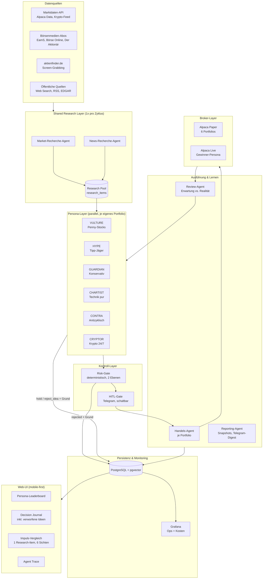

# Agentic Trading System — Architektur-Dokumentation (Phase 1, v2)

**Projekt-Codename:** ATLAS (Agentic Trading & Learning Analysis System)
**Autor:** Ralf Schmid, unterstützt durch Claude
**Stand:** Juli 2026 — v2.1 (alle Phase-1-Entscheidungen getroffen, siehe §7)
**Status:** Phase 1 abgeschlossen (Architektur-Entscheidungen unten weiterhin
verbindlich). Projektfortschritt: siehe `docs/dod/phase-N.md` — aktuell
Phase 4 (Scheduler seit 07.07.2026 live, siehe `docs/dod/phase-4.md`).

**Changelog v1 → v2:**
- Kernkonzept erweitert: **6 parallele Strategie-Personas** im Paper-Wettbewerb, nach 8 Wochen geht der Gewinner mit echtem Geld live (§4)
- **2–4 Entscheidungszyklen pro Handelstag** statt 1 (§5.2), Krypto-Persona 24/7
- Shared-Research-Layer: Recherche läuft einmal pro Zyklus, alle Personas bewerten dieselben Impulse (§2, Kernprinzip 2)
- Guardrails in **zwei Ebenen**: systemweit vs. persona-spezifisch (§6)
- HITL via **Telegram-Bot**, phasenweise zu-/abschaltbar (§5.3, §6.4); Alerts + Tagesdigest via Telegram (§6.4, §9.3)
- Fixiert: LangGraph + MCP, LiteLLM, Postgres, Next.js/React + FastAPI (mobile-first), Grafana-Anbindung, GitHub Private Repo mit CI ab Phase 2
- Whitelisting bewusst entfernt — nur technische Handelbarkeit als Filter (§6.1)
- Lokale-LLM-Prüfung UGREEN/32 GB durchgeführt (§3.3.1), Groq/Multi-LLM-Strategie (§3.3.2)
- Zeitschriften-Ingestion konkretisiert: boersenmedien.com-Abos, Mail-Trigger + PDF-Fallback (§3.5.1); aktienfinder via Screen-Grabbing (§3.5.2)
- Harte, messbare DoD je Phase (§8) + verbindlicher Feature-Einbau-Prozess (§10)

---

## 1. Projektziele und Nicht-Ziele

### 1.1 Ziele

1. **Exploration:** Ausloten, was mit heutigen Agentic-AI-Mitteln im Finanzumfeld möglich ist — von Recherche über Entscheidung bis Orderausführung.
2. **Strategie-Wettbewerb:** Sechs Personas mit bewusst extremen, gegensätzlichen Anlagephilosophien handeln parallel im Paper-Modus auf identischer Informationsbasis. Nach 8 Wochen geht der Gewinner nach vorab fixierten Kriterien (§4.7) mit 2.000 € echtem Kapital live.
3. **Vergleichbarkeit:** Gleiche Impulse, unterschiedliche Interpretation — das System macht sichtbar, wie verschiedene Philosophien (und optional verschiedene LLMs) dieselben Informationen bewerten.
4. **Technisches Lernen:** Multi-Agent-Systeme in der Praxis — LangGraph-Orchestration, MCP-Tool-Anbindung, Guardrails, Human-in-the-Loop, Observability, Kosten-Governance.
5. **Nachvollziehbarkeit (Data Lineage):** Jede Entscheidung — auch jede *verworfene* Idee — ist mit Rationale, Quellen und Erwartung persistiert und über eine mobile-first Web-UI einsehbar.
6. **Vorzeigbarkeit:** Saubere Architekturdokumentation + präsentable Oberfläche.

### 1.2 Explizite Nicht-Ziele

- **Kein Renditeversprechen.** Lern- und Explorationsprojekt; Benchmark-Underperformance ist ein valides, dokumentiertes Ergebnis.
- **Kein High-Frequency Trading.** 2–4 Zyklen/Handelstag, keine Reaktionszeiten unter Minuten.
- **Kein Fremdkapital, keine Verwaltung fremder Gelder.** Eigenhandel als Privatperson ist erlaubnisfrei (§ 32 KWG greift nur bei Dienstleistungen für Dritte).
- **Keine Marktmanipulation** (MAR-Guardrail; bei den Volumina praktisch irrelevant, aber dokumentiert).

---

## 2. Systemübersicht



**Kernprinzip 1 — Trennung von "Denken" und "Dürfen":** LLM-Personas analysieren und schlagen vor. Das deterministische Risk-Gate (kein LLM) prüft jede Order gegen zwei Regelebenen. Ein LLM darf niemals seine eigenen Limits interpretieren oder ändern.

**Kernprinzip 2 — Shared Research, individuelle Interpretation:** Recherche ist teuer (Token) und soll vergleichbar sein. Sie läuft **einmal pro Zyklus** und schreibt in einen gemeinsamen Research Pool. Jede Persona konsumiert denselben Pool durch ihre eigene "Brille" (Persona-Charter im System-Prompt). Nebeneffekt: Der Impuls-Vergleich ("6 Personas, 1 Nachricht, 6 Reaktionen") wird eine simple Query, und die Recherche-Kosten skalieren nicht mit der Persona-Anzahl.

**Kernprinzip 3 — Verworfenes ist gleichwertig persistiert:** Jede Persona schreibt pro Zyklus nicht nur Kauf-/Verkaufsentscheidungen, sondern auch explizit geprüfte und verworfene Ideen mit Begründung (`decision.action = 'reject_idea'`). Data Lineage: Quelle → research_item → decision (inkl. rejected) → order → fill → review.

---

## 3. Entscheidungsfelder — getroffene Entscheidungen und Details

### 3.1 Broker: Alpaca (entschieden)

- **Paper-Phase:** Alpaca Paper Trading API — identisches API-Spec wie Live, nur anderer Endpoint/Key (docs.alpaca.markets → Paper Trading). Das Dashboard erlaubt **mehrere Paper-Accounts pro Login** ("Open New Paper Account", je eigene Keys). Zielbild: **ein Paper-Account je Persona** (6 Stück) — Cash, Fills und Buchführung sind damit broker-seitig sauber getrennt. Fallback, falls Alpaca die Anzahl begrenzt (Spike in P2): ein Paper-Account + interner Ledger mit virtuellen Sub-Portfolios in Postgres. Der Broker-Adapter kapselt beide Varianten.
- **Kapitalisierung:** 5.000 (virtuell) je Persona — Paper-Accounts laufen in **USD**; wir setzen 5.000 USD je Account (Startbetrag beim Anlegen wählbar) und zeigen in der UI eine EUR-Referenz. Live-Phase: 2.000 € → USD-Funding (nur USD-Einzahlung möglich, Weg über Rapyd/Wise, siehe Alpaca-Support-Doku "International funding").
- **Krypto:** Alpaca bietet Krypto in derselben API (24/7). **Gotcha Live-Phase:** Alpaca-Krypto unterliegt geo-abhängigen Einschränkungen ("Additional geographic restrictions may apply", alpaca.markets Disclosures) — ob CRYPTOR live über Alpaca oder einen Kraken-Adapter handelt, wird in P2 verifiziert (§7). Paper funktioniert.
- **US-only bestätigt.** US-Optionen bleiben Ausbaustufe, kein Startumfang. IBKR bleibt dokumentierter Fallback (Adapter-Pattern §9.4).

### 3.2 Hosting: UGREEN DXP4800 Pro (entschieden)

- Docker-Compose-Stack auf TrueNAS, Zugriff über bestehendes VPN, kein öffentliches Exposure.
- Verfügbarkeits-Design: Stop-Loss-Orders liegen als GTC **beim Broker** — ein verpasster Zyklus erzeugt keinen Schaden. Ergänzend: **Grafana-Alerting auf Container-Health** — Healthcheck-Endpoint je Service, Alert nach 2 aufeinanderfolgenden Fehlversuchen, Zustellung über Telegram-Contact-Point (Grafana unterstützt Telegram nativ, Grafana Docs → Alerting → Contact Points). Kompletter Box-Ausfall fällt dir ohnehin schnell auf (bestehende Überwachung).

### 3.3 LLM-Strategie

#### 3.3.1 Kritische Prüfung: Lokale LLMs auf der UGREEN (32 GB RAM, keine GPU)

Nüchterne Rechnung für den DXP4800 Pro (Intel Pentium Gold 8505: 1 P-Core + 4 E-Cores, Dual-Channel DDR5, theoretische Speicherbandbreite ~35–38 GB/s):

- **Decode ist speicherbandbreiten-limitiert:** Faustregel t/s ≈ Bandbreite ÷ Modellgröße im RAM (llama.cpp-Community-Benchmarks, Stand Training Jan 2026). 8B-Modell Q4 (~5 GB) → theoretisch ~7 t/s, real 4–6. Dichtes 30B (~18 GB) → ~2 t/s, unbrauchbar. Einzig interessante Klasse: **MoE wie Qwen3-30B-A3B** (~3B aktive Parameter/Token) → realistisch 8–12 t/s Decode.
- **Der eigentliche Killer ist Prefill:** Prompt Processing ist compute-bound auf 5 schwachen Kernen, realistisch 15–40 t/s. Unsere Kern-Workloads sind Long-Context: eine Zeitschriften-Ausgabe hat 30–80k Token. 50k Token ÷ 25 t/s ≈ **33 Minuten pro Aufruf** — bei 2–4 Zyklen × mehreren Agenten nicht betreibbar.
- **RAM-Konkurrenz:** 32 GB teilen sich mit ZFS ARC (TrueNAS belegt ARC aggressiv), Postgres, n8n, Immich & Co. Ein 18-GB-Modell dauerhaft resident stranguliert den ARC → NAS-Performance bricht ein.
- **Qualität:** Die 3–8B-Aktiv-Klasse liefert bei Finanz-Reasoning mit Structured Output/Function Calling deutlich erhöhte Fehlerraten — genau dort, wo Fehler Geld kosten.

**Verdict: Lokale LLMs nicht im Trading-Pfad.** Sinnvolle lokale Nutzung:
1. **Embeddings lokal** (`bge-m3` oder `nomic-embed-text` via Ollama/llama.cpp): CPU-tauglich (Sekundenbereich), füttert pgvector für semantische Suche über Research-Historie und Lessons — spart API-Kosten bei jedem Retrieval.
2. Optional nachts: unkritisches Tagging/Klassifizieren von Research-Items (Qwen3-4B/8B) als Experiment — nice-to-have, keine Abhängigkeit darauf bauen.

#### 3.3.2 Provider-Mix via LiteLLM (entschieden)

- **LiteLLM als self-hosted Proxy/Router:** einheitliches OpenAI-kompatibles Interface, **Budgets/Rate-Limits pro virtuellem Key** (LiteLLM Docs → Budgets & Rate Limits), Kosten-Logging pro Request → LiteLLM ist damit gleichzeitig der Enforcement-Punkt des Kosten-Guardrails (§6.3). Je Agent-Rolle × Persona ein eigener Key → Kostenzuordnung pro Persona fällt gratis ab und landet in Grafana.
- **Modell-Zuordnung (Start):**
  - Recherche (Volumen, Extraktion): **Claude Haiku 4.5**; Experiment-Slot: **Groq** (offene Modelle der 70B-Klasse; Groq ist bei offenen Modellen die günstigste schnelle Option, Größenordnung ~0,6/0,8 $ pro M Token — Stand Training, Preise vor P2 verifizieren).
  - Persona-Analyse (Reasoning, Structured Decisions): **Claude Sonnet 4.6**.
  - Review: Sonnet. Reporting: Haiku bzw. reiner Code.
- **LLM-Diversitäts-Experiment (aufgenommen, P7):** identischer Persona-Charter, unterschiedliche Modelle — z.B. GUARDIAN-Claude vs. GUARDIAN-Llama/Groq als 7. Portfolio. Bewusst *ein* A/B-Paar statt voller Matrix (6 × n Modelle explodiert in Kosten und Auswertbarkeit). Architektur-Voraussetzung schon erfüllt: `persona.model` ist Config, kein Code.

#### 3.3.3 Kostenmodell (4 Zyklen, 6 Personas, Shared Research)

| Posten | Annahme | Kosten/Tag (grob) |
|---|---|---|
| Shared Research (Haiku), 4 Zyklen | Zyklus 1 voll inkl. News-Pool (~120k in), Zyklen 2–4 inkrementell (~40k in) | ~0,30 $ |
| Persona-Analyse (Sonnet), 6 × 4 Aufrufe | je ~20k in (Prompt Caching auf Charter/Regeln: ~60 % cached, Cache-Hits ≈ 10 % des Input-Preises, Anthropic Docs → Prompt Caching) / 3k out | ~2,50–3,50 $ |
| Review + Reporting | täglich + Wochenlauf | ~0,50 $ |
| **Summe** | | **~3–5 $/Tag ≈ 60–110 €/Monat** |

Guardrail (entschieden, §7.1): **Hard Cap 5 €/Tag systemweit + 1 €/Tag je Persona** (LiteLLM-Budgets), Monats-Soft-Cap 120 € mit Telegram-Warnung ab 80 %.

### 3.4 Framework: LangGraph + MCP (entschieden)

- LangGraph (Python 3.12) mit **Postgres-Checkpointer** (`langgraph-checkpoint-postgres`) — Resume nach Crash; **Interrupts** (`interrupt()` / `Command(resume=...)`, LangGraph Docs → Human-in-the-loop) sind exakt der Mechanismus für die Telegram-Bestätigung: Graph pausiert am HITL-Node, der Telegram-Callback resumed mit approve/reject.
- Personas laufen innerhalb eines Zyklus parallel (LangGraph `Send`/Map über die Portfolio-Liste).
- MCP für Tool-Anbindung: Alpaca-MCP-Server (github.com/alpacahq/alpaca-mcp-server) für Trading/Marktdaten des Handels-Agenten; eigene MCP-Server nur, wo Lerneffekt entsteht — sonst native LangGraph-Tools (weniger Moving Parts).
- n8n bleibt Ingestion-Scheduler (Mail-Trigger, Feeds, File-Watcher), nicht Agent-Orchestrator.

### 3.5 Datenquellen

#### 3.5.1 Börsenmedien-Abos (Euro am Sonntag, Börse Online, Der Aktionär)

- **Zugang:** ein Login über konto.boersenmedien.com, drei Titel, Erscheinung wöchentlich, **Mail-Benachrichtigung bei neuer Ausgabe** → idealer Trigger.
- **Ziel-Pipeline (automatisiert):** n8n-IMAP-Trigger auf die Benachrichtigungs-Mail → Playwright-Job (Container) loggt sich ein und lädt die Ausgabe als PDF → Ablage `/data/ingest/publications/<titel>/<datum>.pdf` → Parser (PyMuPDF/Docling: Text, Struktur, Artikel-Segmentierung) → `staging.publication_article` → Event an den Orchestrator ("neue Ausgabe", fließt in den nächsten Zyklus ein).
- **Fallback (manuell, identische Pipeline ab PDF):** PDF selbst ins Ingest-Verzeichnis legen (n8n File-Watcher). Der Fallback wird **zuerst** gebaut (P3-DoD), die Playwright-Automatisierung reift danach — der Agenten-Betrieb hängt nie am fragilsten Glied.
- **Gotchas:** (a) Paywall-Login via Headless-Browser kann an Bot-Detection/2FA scheitern → Fallback-first. (b) ToS: automatisierter Abruf rein zur privaten Auswertung; Volltexte bleiben intern, die UI zeigt nur Zusammenfassungen + Quellenverweis (Titel/Ausgabe/Seite). (c) Wochenrhythmus im Tages-Zyklussystem: research_items tragen `published_at`; Personas gewichten Aktualität selbst (HYPE liebt frische Tipps, GUARDIAN ist das Erscheinungsdatum fast egal).

#### 3.5.2 aktienfinder.de (entschieden: Screen-Grabbing)

- Playwright mit eingeloggter Session rendert gezielte Views (Fair-Value-Charts, Qualitäts-Scores, Dividenden-Historie) für Beobachtungskandidaten → DOM-Extraktion der Werte (robuster und billiger als Vision) + Screenshot als Beleg → `staging.aktienfinder_snapshot` (strukturierte Felder + Bild-Referenz für die Lineage).
- Frequenz 1×/Tag (Fundamentaldaten ändern sich nicht pro Zyklus). Primärnutzer: GUARDIAN, CONTRA.

#### 3.5.3 Markt- und sonstige Daten

- Kurse/Bars: Alpaca Market Data (Aktien + Krypto); technische Indikatoren werden **im Code** berechnet (pandas/pandas-ta), nie vom LLM.
- EDGAR-RSS (kostenlos, offiziell, sec.gov) für Filings; Web-Search-API (Tavily o.ä.) für den News-Recherche-Agenten.
- **Konsequenz aus "kein Whitelisting":** Universum = komplettes Alpaca-Asset-Verzeichnis (`GET /v2/assets`, Filter nur `tradable=true, status=active`). VULTURE bekommt einen täglichen **Screener-Lauf** (Preis < 5 $, Mindestvolumen als *Datenqualitäts*-, nicht Verbotsfilter) — sonst sucht ein LLM in 10.000+ Symbolen und verbrennt Token.

### 3.6 Persistenz: PostgreSQL (entschieden)

```
persona(id, name, charter_version, model, config_ref, active, created_at)
portfolio(id, persona_id, mode[paper|live], broker_account_ref, base_ccy, start_value)
cycle(id, trading_day, seq, started_at, market_session[us_equity|crypto])
agent_run(id, cycle_id, portfolio_id NULL wenn shared, agent, status,
          tokens_in, tokens_out, cost_usd, error)
research_item(id, cycle_id, agent, source_type, source_ref, url, published_at,
              summary, sentiment, instruments[], raw jsonb)          -- shared
decision(id, cycle_id, portfolio_id, instrument,
         action[buy|sell|hold|close|reject_idea], quantity,
         thesis_text, rejection_reason,
         expected_outcome jsonb {entry_price, stop_loss_price, conviction,
                                 existing_position_value_usd, target_position_value_usd},
         input_research_ids[] NOT NULL, risk_check jsonb,
         hitl jsonb {required, decided_by[user|timeout|disabled], at}, status)
order_record(id, decision_id NOT NULL, broker, broker_order_id, mode,
             submitted_at, filled_at, fill_price, fees, status, raw jsonb)
position_snapshot(id, ts, portfolio_id, instrument, qty, avg_price, market_value, pnl_unrealized)
portfolio_snapshot(id, ts, portfolio_id, total_value, cash, pnl_realized,
                   pnl_unrealized, benchmark_value, max_drawdown)
review(id, decision_id, reviewed_at, expected jsonb, actual jsonb, deviation,
       slippage_malus, verdict[thesis_confirmed|thesis_failed|inconclusive], lessons_text)
cost_ledger(id, ts, scope[system|persona], persona_id, provider, model,
            tokens_in, tokens_out, cost_usd)
```

- **Lineage-Garantie:** `decision.input_research_ids[]` ist Pflicht (Prompt erzwingt Referenzen, Persistenz-Layer validiert Existenz). Verworfene Ideen (`reject_idea`) tragen `rejection_reason` — "welcher Input führte wozu, was wurde warum verworfen" ist eine SQL-Query.
- pgvector auf `research_item.summary` + `review.lessons_text` (lokale Embeddings §3.3.1) für Retrieval "ähnliche frühere Situationen/Lessons" im Analyse-Kontext.
- **Grafana** liest Postgres direkt als Datasource: Ops (Runs, Fehler, Ingestion-Freshness), Kosten (`cost_ledger`), Portfolio-Kurven. Die eigene Web-UI bleibt zuständig für Journal/Vergleich/Trace — Grafana für Ops & Metriken, keine Doppelentwicklung.

### 3.7 Web-Oberfläche: Next.js/React SPA + FastAPI (entschieden), mobile-first

- **Mobile-first als hartes Designkriterium:** alle Views zuerst für ~390 px (Bottom-Navigation, Card-Layouts, Touch-Targets ≥ 44 px, keine Hover-only-Interaktionen). Desktop ist die Erweiterung. Tailwind + shadcn/ui, Recharts.
- **Views:**
  1. **Leaderboard** — 6 Personas + SPY-Benchmark: Wertentwicklung (roh und slippage-adjustiert), Max Drawdown, Trade-Count, offene Positionen; Sparklines mobil, Details per Tap.
  2. **Decision Journal** — je Portfolio chronologisch: Thesis, verlinkte Quellen, Erwartung, Ist-Verlauf, Review-Verdict; **inkl. verworfener Ideen** (filterbar).
  3. **Impuls-Vergleich** — Einstieg über ein research_item: was hat jede Persona daraus gemacht (gekauft/verworfen/ignoriert) und warum. Das Schaufenster des Experiments.
  4. **Agent Trace** — pro Zyklus: Läufe, Token/Kosten, Fehler, HITL-Ereignisse.
- FastAPI liefert REST + Server-Sent Events für Live-Updates während eines Zyklus (leichter als WebSocket, reicht hier).

---

## 4. Die sechs Personas — Rationale

Designprinzip: Die Personas spannen den Raum entlang dreier Achsen auf — **Risikoappetit** (VULTURE ↔ GUARDIAN), **Informationstyp** (HYPE: narrative Signale ↔ CHARTIST: reine Preisdaten ↔ GUARDIAN: Fundamentaldaten) und **Konsensbezug** (HYPE: mit der Herde ↔ CONTRA: gegen die Herde). CRYPTOR ergänzt die Asset-Klassen-Dimension und den 24/7-Betrieb. Jede Persona ist als Charter (`config/personas/<name>.yaml` + Prompt) versioniert; Charter-Änderungen erzeugen eine neue `charter_version` — sonst ist der 8-Wochen-Vergleich wertlos.

### 4.1 VULTURE — Penny-Stock-Jäger (Extremum: maximales Einzelwert-Risiko)

- **Philosophie:** Asymmetrische Wetten auf Micro-Caps — viele kleine Einsätze, Totalverluste eingeplant, einzelne Vervielfacher sollen das Portfolio tragen (Lottery-Ticket-Ansatz).
- **Universum:** US-Aktien Preis < 5 $, Market Cap < 300 M$, Tagesvolumen > 500k Stück (Datenqualitätsfilter).
- **Signale:** Volumen-Spikes, Kurssprünge, EDGAR-Filings (8-K, Insider-Käufe), News-Nennungen — bewusst auch spekulative Quellen.
- **Haltedauer:** Tage bis wenige Wochen. **Persona-Guardrails:** max. 3 % je Position, max. 10 Trades/Tag, Stop-Loss -25 % (weite Stops, kleine Positionen), max. 25 offene Positionen.
- **Erwarteter Failure Mode (für den Review dokumentiert):** Paper-Fills überschätzen die Realität massiv — Penny-Stocks haben Spreads von 5–20 %, die Alpaca-Paper nicht simuliert (Fill sobald marketable, ohne Liquiditätsprüfung, docs.alpaca.markets → Paper Trading). VULTURE erhält deshalb im Review einen **Slippage-Malus** (§4.7-Kriterium 2), sonst gewinnt er den Wettbewerb mit Fantasie-Fills.

### 4.2 HYPE — Tipp-Jäger (Extremum: maximale Narrativ-Gläubigkeit)

- **Philosophie:** Momentum + Empfehlungs-Following. Kauft, was Euro am Sonntag/Börse Online/Der Aktionär und Analysten-Upgrades pushen; verkauft, wenn die Story abkühlt. Testet messbar die Hypothese "publizierte Tipps haben noch Alpha".
- **Universum:** alles US-Handelbare mit expliziter Empfehlung/Upgrade der letzten 14 Tage.
- **Signale:** Zeitschriften-Kaufempfehlungen (Kernquelle!), Analyst-Upgrades, News-Sentiment-Spitzen, 5/20-Tage-Momentum als Bestätigung.
- **Haltedauer:** 1–6 Wochen, Exit bei Momentum-Bruch oder Gegen-News. **Persona-Guardrails:** max. 8 % je Position, max. 6 Trades/Tag, Stop-Loss -12 %, max. 15 Positionen.
- **Erwarteter Failure Mode:** kauft am Empfehlungs-Peak (Publikationseffekt — Tipps sind bei Erscheinen weitgehend eingepreist), Whipsaw bei Momentum-Brüchen.

### 4.3 GUARDIAN — Der Konservative (Extremum: minimales Risiko, minimale Aktivität)

- **Philosophie:** Quality/Value mit Dividendenfokus. Kauft unterbewertete Qualität, hält lange, Cash ist eine Position. Nichtstun ist der Default und wird als `hold`-Decision mit Begründung persistiert.
- **Universum:** US Large/Mid Caps, > 10 Jahre Gewinnhistorie, Dividendenkontinuität; Kernquelle **aktienfinder.de** (Fair Value, Qualitäts-Scores).
- **Signale:** Fair-Value-Abschlag > 15 %, stabile Fundamentaldaten, Dividendenrendite; News/Zeitschriften eher als Kontraindikator ("zu viel Euphorie → warten").
- **Haltedauer:** Monate+ (im 8-Wochen-Fenster strukturell benachteiligt — bewusst: die "ruhige Hand"-Referenz im Feld). **Persona-Guardrails:** max. 15 % je Position, max. 5 Trades/Tag (praktisch 2–5/Woche), Stop-Loss -15 %, min. 20 % Cash-Reserve, max. 12 Positionen.
- **Erwarteter Failure Mode:** in 8 Bullenmarkt-Wochen chancenlos wirkend (Underinvestment) — die Risiko-Adjustierung in §4.7 korrigiert das teilweise.

### 4.4 CHARTIST — Der Techniker (Extremum: Fundamentaldaten-Blindheit)

- **Philosophie:** "Der Preis enthält alles." Handelt ausschließlich Preis-/Volumenmuster, liest keine News und keine Fundamentals — **Kontrollgruppe** für den Informationswert der teuren Content-Pipeline.
- **Universum:** liquide US-Aktien/ETFs (Tagesvolumen > 1 M Stück, Preis > 10 $).
- **Signale:** ausschließlich code-berechnete Indikatoren (SMA-Crossover 20/50, RSI, MACD, Bollinger, Breakouts; Tagesbasis + 15-Min-Bars fürs Timing innerhalb der Zyklen). Der LLM-Anteil ist bewusst klein: Signal-Synthese und Konfliktauflösung, keine Mustererkennung aus Rohdaten.
- **Haltedauer:** Tage bis Wochen, strikt regelbasierte Exits. **Persona-Guardrails:** max. 10 % je Position, max. 8 Trades/Tag, Stop per ATR (2×ATR14, mindestens -8 %), max. 15 Positionen.
- **Erwarteter Failure Mode:** Seitwärtsmärkte fressen ihn über Fehlsignale auf; klassische TA auf Tagesbasis hat nach Kosten dünne Evidenz (etablierter Empirie-Befund, vgl. Park/Irwin-Survey zur Profitabilität Technischer Analyse).

### 4.5 CONTRA — Der Antizykliker (Extremum: gegen den Konsens)

- **Philosophie:** Mean Reversion + Sentiment-Fading. Kauft Qualität nach Panik-Abverkäufen, meidet Euphorie. **Spiegelbild von HYPE:** nutzt dieselben Sentiment-Signale mit umgekehrtem Vorzeichen — das sauberste Teilexperiment, weil zwei Personas identische Inputs gegensätzlich interpretieren.
- **Universum:** US Mid/Large Caps mit Kursrückgang > 15 % in 20 Tagen ohne fundamentale Zerstörung (Cross-Check gegen aktienfinder-Qualität + Filings).
- **Signale:** RSI < 30 auf Qualitätswerten, Downgrade-Kaskaden (kauft, wenn "alle" abgestuft haben), extreme Negativ-Sentiment-Spitzen im Research Pool.
- **Haltedauer:** 2–8 Wochen (Reversion-Fenster). **Persona-Guardrails:** max. 10 % je Position, max. 5 Trades/Tag, Stop-Loss -15 %, Einstieg gestaffelt in 2 Tranchen (Falling-Knife-Schutz), max. 12 Positionen.
- **Erwarteter Failure Mode:** Falling Knives — "billig" wird billiger, wenn der Konsens recht hat.

### 4.6 CRYPTOR — Krypto-Spezialist (Extremum: Asset-Klasse, Volatilität, 24/7)

- **Philosophie:** Trend-Following auf liquiden Krypto-Majors, Volatilität als Werkzeug. Einziger Agent ohne Börsenschluss — testet den 24/7-Betrieb (eigene Zyklen auch am Wochenende).
- **Universum:** via Alpaca handelbare Krypto-Paare, Fokus Top-Liquidität (BTC, ETH, SOL + wenige weitere). Keine Meme-Coin-Jagd — das Extremrisiko deckt VULTURE bei Aktien ab.
- **Signale:** Momentum/Trend (code-berechnet), Sentiment aus dem News-Pool, BTC-Dominanz als Regime-Filter.
- **Haltedauer:** Tage bis Wochen. **Persona-Guardrails:** max. 20 % je Position (kleines Universum), max. 8 Trades/Tag, Stop-Loss -10 %.
- **Live-Vorbehalt:** Alpaca-Krypto für DE-Residents verifizieren, Fallback Kraken-Adapter (§3.1). **Steuer-Gotcha Live:** Krypto = § 23 EStG, FIFO, 1-Jahres-Haltefrist → Datenmodell braucht Lot-Tracking, falls CRYPTOR live geht.

### 4.7 Gewinner-Auswahl nach 8 Wochen (Kriterien vorab fixiert)

Vorab fixiert, damit nicht post hoc der sympathischste Agent gewinnt:

1. **Risiko-adjustierte Rendite** (Sortino Ratio über 8 Wochen, tägliche Snapshots) — Gewicht 40 %
2. **Gesamtrendite nach synthetischen Kosten** (Slippage-Malus, simulierte Ordergebühren) — 25 %
3. **Max Drawdown** (invers) — 15 %
4. **Thesen-Qualität:** Anteil `thesis_confirmed` an abgeschlossenen Reviews — 10 %
5. **Operative Zuverlässigkeit:** Fehlerquote, Risk-Gate-Reject-Quote, Fill-Plausibilität — 10 %

**Ehrlicher statistischer Disclaimer (bleibt in der Doku):** 8 Wochen ≈ 40 Handelstage reichen nicht für eine signifikante Strategie-Unterscheidung — der "Gewinner" ist mit hoher Wahrscheinlichkeit Regime- und Rausch-Glück. Für das Projektziel (Lernen, Vergleich, Mechanik) ist das in Ordnung und wird so ausgewiesen. Konsequenz: Der Paper-Wettbewerb läuft nach der Kür **weiter**, der Live-Gewinner wird quartalsweise gegen das Feld re-evaluiert (§7.3).

---

## 5. Agenten-Design & Ablauf

### 5.1 Rollenmodell

| Agent | Instanzen | Modell | Aufgabe |
|---|---|---|---|
| Market-Recherche | 1 (shared) | Haiku | Kurslage, code-berechnete Indikatoren, Screener (inkl. VULTURE-Screener), Auffälligkeiten → research_items |
| News-Recherche | 1 (shared) | Haiku (Groq-Experiment-Slot) | Zeitschriften-Artikel, aktienfinder-Snapshots, Web/News/EDGAR: Extraktion, Sentiment, Instrument-Tagging → research_items |
| Persona-Analyse | 6 (je Portfolio) | Sonnet | Research Pool durch die Persona-Brille → decisions (buy/sell/hold/close/**reject_idea**) mit Thesis, Erwartung, Pflicht-Referenzen |
| Risk-Gate | 1 | **kein LLM** | Zwei-Ebenen-Regelprüfung (§6) je Decision |
| HITL-Gate | 1 | kein LLM | Telegram-Approval bei aktivem HITL (LangGraph-Interrupt) |
| Handels-Agent | 1 (portfolio-parametrisiert) | toolgesteuert, minimal-LLM | Orders + GTC-Stops platzieren, Fills überwachen → order_records |
| Review-Agent | 1 | Sonnet | fällige Decisions vs. Erwartung; Slippage-Malus (Code) + Verdict/Lessons (LLM); Meta-Review der Recherche-Qualität |
| Reporting-Agent | 1 | Code (+Haiku für Freitext) | Snapshots, Telegram-Tagesdigest, Wochenreport |

### 5.2 Zyklusmodell (2–4 Zyklen/Handelstag, konfigurierbar)

Scheduling in **Exchange-Zeit `America/New_York`** konfigurieren (US-Markt 09:30–16:00 ET = 15:30–22:00 MEZ / 16:30–23:00 MESZ) — lokales Scheduling bricht an DST-Grenzen.

```
Aktien-Zyklen (America/New_York):
  C1  09:00 ET  Pre-Open:    voller Lauf inkl. News-/Zeitschriften-Pool;
                             Orders als Limit zur Eröffnung
  C2  10:30 ET  Vormittag:   inkrementell (Research-Delta seit C1), Reaktion auf Eröffnung
  C3  13:00 ET  Mittag:      inkrementell
  C4  15:15 ET  Vor Schluss: inkrementell; Fokus Exits & Overnight-Risiko
Start-Konfiguration (entschieden): alle 4 Zyklen von Beginn an aktiv.
Einzelne Zyklen bleiben per Config abschaltbar (Betriebs-Fallback, kein Plan).

CRYPTOR: Mo–Fr 4 Zyklen/Tag (00/06/12/18 UTC), Sa/So 2 Zyklen (06/18 UTC) — entschieden.

Täglich nach US-Close: Reporting (Fills, Snapshots, Telegram-Digest)
Sonntag: Review-Wochenlauf + Leaderboard-/Kriterien-Report
```

- **Inkrementelle Zyklen** senken Kosten: C2–C4 erhalten nur das Research-Delta + Portfolio-Änderungen; Charter/Regeln kommen aus dem Prompt Cache.
- Jeder Zyklus = ein LangGraph-Run mit `cycle_id`.

### 5.3 Demo→Live-Phasenlogik (HITL-Schaltung, wie von dir spezifiziert)

| Phase | Modus | HITL |
|---|---|---|
| Paper Wochen 1–2 | 6× Paper | **an** (Telegram-Approve je Order) — Einschwingphase, Vertrauen ins Risk-Gate aufbauen |
| Paper Wochen 3–8 | 6× Paper | **aus** (Config-Umschaltung ohne Deploy: `/hitl off` bzw. `config/hitl.yaml`) |
| Live-Start | Gewinner live (2.000 €), Feld läuft paper weiter | **an** für Live-Orders (Paper bleibt aus) |
| Live-Reife | nach Bewährung (Vorschlag: 4 Wochen ohne Risk-Inzidenz) | **aus**, per bewusster Entscheidung + ADR |

Mechanik: risk-approved Decision → Telegram-Message mit Inline-Buttons ✅/❌ (+ Kurz-Thesis, Betrag, Stop) → Callback resumed den LangGraph-Interrupt. **Timeout 30 Min = Reject** (`hitl.decided_by='timeout'`). Konfiguration je `mode` und global.

---

## 6. Guardrails — Zwei-Ebenen-Modell

### 6.1 Ebene 1: Systemweit (durch Personas unveränderlich; Änderung nur via ADR + Config-Deploy)

- Pflicht-Stop-Loss je Position als **GTC-Order beim Broker** (nicht nur lokal)
- Circuit Breaker je Portfolio: Drawdown > 15 % vom Portfolio-Höchststand → Portfolio in `sell_only`; Reset nur manuell (Telegram-Kommando) + ADR-Notiz
- Circuit Breaker Live global: Drawdown > 15 % → kompletter Live-Stopp
- LLM-Budget: Hard Cap/Tag systemweit + je Persona — Enforcement **doppelt**: LiteLLM-Budget und Orchestrator-Zähler (zwei unabhängige Bremsen)
- Keine Order ohne persistierte, risk-geprüfte Decision (DB-Constraints erzwingen die Kette)
- Kein Margin, kein Leverage, kein Short im Startumfang (Aufweichung nur per ADR)
- Universum: nur technischer Filter `tradable=true, status=active` — **kein inhaltliches Whitelisting** (bewusste Entscheidung für maximale Diversität; das Risiko tragen Positionsgrößen-Limits und Pflicht-Stops statt einer Titelliste)

### 6.2 Ebene 2: Persona-spezifisch (`config/personas/<name>.yaml`, versioniert)

Felder je Persona: `max_position_pct`, `max_trades_per_day`, `stop_loss_policy`, `max_open_positions`, `min_cash_pct`, `universe_screen` (Screener-Parameter, kein Verbot), `order_types_allowed`, `model`. Startwerte in §4.1–4.6 (z.B. VULTURE 10 Trades/Tag vs. GUARDIAN 5). Das Risk-Gate lädt beide Ebenen; bei Konflikt gilt die strengere Regel. Jede Ablehnung wird mit den ausgewerteten Regeln persistiert (`risk_check.rules_evaluated`) — Reject-Gründe sind in UI und Grafana sichtbar.

### 6.3 Kosten-Guardrail (Detail)

- LiteLLM-Budgets pro virtuellem Key (je Agent-Rolle × Persona) mit Hard Limit → provider-seitige Bremse.
- Orchestrator-seitig: `cost_ledger`-Tagessumme; 80 % → Telegram-Warnung; 100 % → keine weiteren LLM-Aufrufe im Tageslauf (bereits platzierte Orders/Stops bleiben unberührt — Sicherheit vor Sparsamkeit).
- Grafana: "Cost per Persona per Day" + Ausreißer-Alert (Tageskosten > 2× 7-Tage-Median → Hinweis auf Retry-Schleife).

### 6.4 Telegram-Bot (ein Bot, drei Funktionen)

1. **HITL-Approvals** (Inline-Buttons, §5.3)
2. **Alerts** (statt Mail): Run failed, Circuit Breaker, Budget-Schwellen, Container-Health (Grafana-Contact-Point)
3. **Tagesdigest** (fix angefordert): durchgeführte Trades je Persona, Depotwert je Persona + gesamt, Cash-Reserve, offene Positionen, LLM-Tageskosten. Digest ist Code (Jinja-Template über Snapshot-Queries), kein LLM nötig.

Bot-Kommandos: `/status`, `/pause <persona>`, `/resume <persona>`, `/hitl on|off`, `/digest`. Sicherheit: Bot akzeptiert ausschließlich die konfigurierte Chat-ID — HITL-Buttons wären sonst ein Angriffsvektor.

---

## 7. Entscheidungsstand (alle v2-Fragen geklärt, Juli 2026)

1. **Kosten-Caps (entschieden):** Hard Cap 5 €/Tag systemweit, 1 €/Tag je Persona, Monats-Soft-Cap 120 € mit Telegram-Warnung ab 80 %.
2. **Alpaca-Spikes (bestätigt, Durchführung in P2, je ~½ Tag):** (a) Anzahl paralleler Paper-Accounts pro Login — Ziel 6, Fallback interner Ledger; (b) Krypto-Handel für DE-Residents im Live-Konto — Fallback Kraken-Adapter; (c) Paper-Startkapital frei auf 5.000 USD setzbar. Ergebnisse jeweils als ADR.
3. **Weiterbetrieb (entschieden):** Das Paper-Feld läuft nach der Gewinner-Kür weiter (6× Paper + 1× Live parallel); Quartals-Re-Evaluation des Live-Gewinners gegen das Feld.
4. **CRYPTOR-Wochenende (entschieden):** Sa/So reduziert auf 2 Zyklen (06/18 UTC).
5. **Zyklen (entschieden):** sofort alle 4 Aktien-Zyklen aktiv; Abschaltbarkeit einzelner Zyklen bleibt als Betriebs-Fallback in der Config.
6. **Telegram-Bot (geklärt):** Ralf legt den Bot via BotFather an und liefert Token + Chat-ID als Secrets, sobald P2 das Bot-Grundgerüst erreicht.
7. **LLM-A/B-Experiment (entschieden):** GUARDIAN wird in P7 als Duplikat-Persona mit abweichendem Modell gefahren.
8. **Slippage-Malus (Prinzip entschieden):** `malus = 0,5 × geschätzter Spread + Penalty, wenn Ordergröße > 1 % des Tagesvolumens`; Feinjustierung der Parameter in P5.

Damit ist Phase 1 abgeschlossen; es gibt keine blockierenden offenen Punkte für Phase 2. Verbleibende Unsicherheiten (Alpaca-Spikes) sind als erste P2-Arbeitspakete eingeplant.

---

## 8. Projektphasen mit harten Definition-of-Done

Jede Phase endet mit einem **DoD-Review**: Checkliste in `docs/dod/phase-N.md`, abgehakt mit Datum + Nachweis-Links (Commits, Dashboards, Screenshots). Eine Phase gilt erst als abgeschlossen, wenn *alle* Punkte erfüllt sind; Ausnahmen nur per begründetem ADR.

### P2 — Fundament
**Inhalt:** GitHub-Repo (privat) + CI, Docker-Stack, DB-Schema, Broker-Adapter (Paper), LiteLLM, FastAPI-Skeleton, erste UI-Seite, Telegram-Bot-Grundgerüst, Alpaca-Spikes (§7.2).
**DoD:**
- [ ] `docker compose up` auf der UGREEN startet den kompletten Stack; alle Services healthy; Grafana-Container-Health-Alert aktiv und einmal testweise ausgelöst (Telegram-Nachweis)
- [ ] GitHub Actions CI: ruff, mypy (strict für `src/risk`, `src/broker`), pytest — grün auf `main`; Branch Protection: kein Merge ohne grüne CI
- [ ] Alembic erzeugt das Schema aus §3.6 vollständig; Downgrade/Rollback getestet
- [ ] Broker-Adapter: Paper-Order (1 Aktie Kauf + GTC-Stop) programmatisch platziert, Fill abgeholt, in `order_record` persistiert; Integrationstest läuft in CI gegen Alpaca-Paper (Keys via GitHub Encrypted Secrets)
- [ ] LiteLLM läuft mit 2 Providern (Anthropic + Groq); ein Budget-Limit testweise gerissen, Verhalten (Block + Log) verifiziert
- [ ] Telegram-Bot: Testnachricht gesendet, Inline-Button-Callback empfangen und verarbeitet
- [ ] UI zeigt einen Portfolio-Snapshot aus der DB; mobil brauchbar (390 px; Lighthouse Mobile Performance/Accessibility ≥ 85)
- [ ] Alpaca-Spikes beantwortet, Ergebnisse als ADRs in `docs/adr/`
- [ ] Coverage: `src/risk` und `src/broker` ≥ 90 % Lines

### P3 — Ingestion
**Inhalt:** Marktdaten-Sync, VULTURE-Screener, RSS/EDGAR, Zeitschriften-Pipeline (Fallback-first), aktienfinder-Grabbing.
**DoD:**
- [ ] PDF-Fallback: manuell abgelegte Ausgabe wird binnen 5 Min erkannt, geparst, segmentiert → `staging.publication_article` mit Titel/Ausgabe/Seite je Artikel
- [ ] n8n-IMAP-Trigger erkennt die Benachrichtigungs-Mail und stößt die Pipeline an (mindestens Fallback-Aufforderung per Telegram; Playwright-Autodownload darf nachgelagert reifen)
- [ ] aktienfinder-Grabbing liefert für 10 Testtitel strukturierte Snapshots + Beleg-Screenshot, täglich per Schedule
- [ ] EDGAR-RSS + Marktdaten-Sync laufen 5 Tage unterbrechungsfrei (Grafana-Freshness-Panel als Nachweis)
- [ ] VULTURE-Screener liefert täglich eine Kandidatenliste mit definierten Feldern
- [ ] Alle Ingestion-Jobs idempotent — doppelte Trigger erzeugen keine Duplikate (Unique Constraints, im Test nachgewiesen)

### P4 — Agenten-Core
**Inhalt:** LangGraph-Graph (Shared Research → 6 Personas parallel → Risk-Gate → HITL → Handels-Agent → Reporting), Zyklen-Scheduling, Kosten-Tracking.
**DoD:**
- [ ] Vollständiger Zyklus läuft automatisch für alle 6 Portfolios; jede Persona erzeugt decisions inkl. `reject_idea`; `input_research_ids`-Pflicht wird DB-seitig validiert
- [ ] Risk-Gate: beide Regelebenen implementiert, **100 % Branch-Coverage** der Regellogik; je Regelklasse mindestens ein echter Reject im Testlauf dokumentiert
- [ ] HITL: Approve, Reject und Timeout alle drei end-to-end nachgewiesen; `/hitl off` wirkt ohne Neustart
- [ ] 5 Handelstage in Folge: alle geplanten Zyklen (4/Tag Aktien + CRYPTOR-Plan) gelaufen, 0 unbehandelte Exceptions; Crash-Recovery getestet (Container-Kill mitten im Zyklus → Resume via Postgres-Checkpointer)
- [ ] Tageskosten ≤ Cap; `cost_ledger` stimmt stichprobenhaft mit LiteLLM-Abrechnung überein
- [ ] Telegram-Tagesdigest kommt täglich; Zahlen gegen DB-Query verifiziert

### P5 — Review, Journal & Wettbewerbsstart
**Inhalt:** Review-Agent + Slippage-Malus, Lessons-Loop, alle 4 UI-Views, Leaderboard, Start des 8-Wochen-Wettbewerbs.
**DoD:**
- [ ] Review-Agent verarbeitet fällige Decisions automatisch; jede geschlossene Position hat binnen 7 Tagen ein Review mit Verdict
- [ ] Slippage-Malus implementiert; Leaderboard weist Roh- und adjustierte Performance getrennt aus
- [ ] UI komplett (Leaderboard, Decision Journal inkl. Rejected-Filter, Impuls-Vergleich, Agent Trace); auf realem Smartphone getestet
- [ ] Lineage-Probe: für 5 zufällige Trades die Kette Quelle→Research→Decision→Order→Fill→Review lückenlos in der UI nachvollzogen (Screenshots im DoD-Dokument)
- [ ] Selektionskriterien (§4.7) als automatischer Wochenreport implementiert
- [ ] **Wettbewerb offiziell gestartet:** Stichtag dokumentiert, alle 6 Portfolios auf 5.000 USD, SPY-Benchmark-Portfolio (virtuell, Buy-and-Hold) läuft mit

### P6 — Live (Gewinner)
**Inhalt:** Gewinner-Kür nach §4.7, Live-Konto-Funding (2.000 €), Live-Adapter, HITL an.
**DoD:**
- [ ] Gewinner-Report (8 Wochen, alle 5 Kriterien) erzeugt; Entscheidung als ADR
- [ ] Live-Keys ausschließlich in der Prod-Umgebung; gitleaks-Scan über gesamte Repo-Historie sauber
- [ ] Erste Live-Order nach Telegram-Approval ausgeführt; GTC-Stop beim Broker verifiziert (Alpaca-Dashboard)
- [ ] Kill-Switch-Drill: Live-Circuit-Breaker simuliert ausgelöst und Verhalten dokumentiert
- [ ] Steuer-Export (Trades-CSV für Anlage KAP) generierbar

### P7 — Autonomie & Experimente
**Inhalt:** HITL-Abschaltung Live nach Bewährung, LLM-A/B-Persona, ggf. 4-Zyklen-Ausbau, ggf. Kraken-/IBKR-Adapter.
**DoD:**
- [ ] HITL-Abschaltung Live erst nach 4 Wochen ohne Risk-Inzidenz, per ADR dokumentiert
- [ ] A/B-Persona läuft mit identischem Charter und abweichendem Modell; Vergleichs-View in der UI
- [ ] Quartals-Re-Evaluation der Live-Persona gegen das Paper-Feld als automatischer Report etabliert

---

## 9. Technische Architektur (Umsetzungsdetails)

### 9.1 Deployment (Docker Compose, UGREEN/TrueNAS)

```yaml
services:
  postgres:       # pgvector-Image; Volume auf ZFS-Dataset, recordsize=16K
                  # (openzfs-docs → Workload Tuning, Postgres-Pragma)
  litellm:        # Proxy: Provider-Routing, Budgets, Kosten-Logging
  orchestrator:   # Python 3.12, LangGraph + Postgres-Checkpointer,
                  # APScheduler mit TZ America/New_York (+ UTC für CRYPTOR)
  ingestion:      # Playwright-fähiges Image (Zeitschriften, aktienfinder)
  api:            # FastAPI (REST + SSE)
  web:            # Next.js
  telegram-bot:   # python-telegram-bot/aiogram; ruft Orchestrator-Resume-API
  embeddings:     # optional: Ollama/llama.cpp nur für bge-m3 (CPU)
  proxy:          # Caddy, ausschließlich im VPN erreichbar
# n8n: bestehende Instanz (Mail-Trigger, File-Watcher, Feeds)
# Grafana/InfluxDB: bestehende Instanz; Postgres als zusätzliche Datasource
```

### 9.2 Secrets & Sicherheit

- Getrennte LiteLLM-Keys je Agent-Rolle × Persona; Alpaca-Keys je Paper-Account + Live separat (Live-Key existiert vor P6 in keiner Umgebung); Telegram-Token + erlaubte Chat-ID; Playwright-Credentials (Börsenmedien, aktienfinder) als Docker Secrets.
- gitleaks im pre-commit **und** in CI; `.env` nie im Repo, `.env.example` nur mit Dummies.
- **Prompt-Injection-Modell:** Recherche-Agenten haben keine Order-Tools; Fremdtexte erreichen die Persona-Analyse nur als klar getaggte Datenblöcke; der Handels-Agent akzeptiert ausschließlich approved Decision-IDs aus der DB — ein bösartiger Artikel kann maximal ein research_item verschmutzen.

### 9.3 Observability & Alerting

- Strukturierte JSON-Logs mit `cycle_id`/`portfolio_id`-Korrelation; LangGraph-Checkpoints in Postgres; optional Langfuse (self-hosted) für Trace-Deep-Dives.
- **Grafana:** Dashboards (Runs/Fehler, Kosten je Persona, Portfolio-Kurven, Ingestion-Freshness) + Alert Rules → Telegram-Contact-Point; Container-Health-Regel: 2 aufeinanderfolgende Fehlschläge → Alert.
- **Telegram:** alle Alerts (statt Mail) + täglicher Digest (§6.4).

### 9.4 Broker-Adapter

```python
class BrokerAdapter(Protocol):
    def get_account(self) -> Account: ...
    def get_positions(self) -> list[Position]: ...
    def submit_order(self, order: OrderRequest) -> OrderResult: ...
    def submit_stop(self, stop: StopRequest) -> OrderResult: ...   # GTC-Stop explizit
    def get_order_status(self, order_id: str) -> OrderStatus: ...
    def get_quotes(self, symbols: list[str]) -> dict[str, Quote]: ...
    def get_bars(self, symbols, timeframe, limit) -> BarFrame: ...

# Instanziierung je Portfolio: AlpacaPaperAdapter(keys[persona]),
# AlpacaLiveAdapter, später KrakenAdapter / IBKRAdapter. Registry via Config.
```

---

## 10. Feature-Einbau-Prozess (verbindlich ab P2)

Jedes neue Feature — auch "kleine" — durchläuft diesen Ablauf. Artefakt: `docs/features/FNNN-<slug>.md` + GitHub-Issue.

1. **Zieldefinition:** Was leistet das Feature, für wen (Persona/Agent/UI/Ops), messbares Erfolgskriterium ("Done heißt: …"). Ein Satz Scope, ein Satz Non-Scope.
2. **Kritische Betrachtung (vor der ersten Zeile Code):** Wirkung auf die Sicherheits-Invarianten (Risk-Gate, HITL, Budget, Lineage)? Token-/Kostenimpact pro Tag? **Fairness:** Verzerrt es den Persona-Vergleich (bekommt eine Persona einen Informationsvorteil)? Alternativen inkl. "nicht bauen". Berührt es eine Invariante → ADR Pflicht.
3. **Testdefinition (vor der Umsetzung):** konkrete Testfälle — Unit (Pflicht bei `risk`/`broker`/Persistenz), Integration (Pflicht bei Order-Pfad/HITL/Ingestion), Eval-Fixture bei Prompt-Änderungen (fixe Beispiel-Inputs, erwartete Output-Struktur). Die Testfälle stehen im Feature-Dokument, bevor implementiert wird.
4. **Umsetzung:** Feature-Branch, Conventional Commits; Prompt-Änderungen versioniert (Charter-Version-Bump, wenn eine Persona betroffen ist).
5. **Kompletter Testdurchlauf:** CI grün (Lint, Typecheck, **gesamte** Test-Suite) **plus** Paper-Smoke-Test: ein kompletter Zyklus in Staging-Konfiguration (reduzierte Persona-Zahl erlaubt) ohne Fehler.
6. **Livesetzung:** Merge auf `main` → Deploy auf die UGREEN (`compose pull && up -d`) → Verifikation im nächsten regulären Zyklus → Eintrag im Feature-Dokument (Deploy-Datum, Beobachtung). Features, die Live-Trading berühren: zusätzlich 5 Handelstage Paper-Bewährung vor Aktivierung im Live-Portfolio.
7. **Rollback-Pfad:** Jedes Feature benennt vorab seine Deaktivierung — Config-Flag bevorzugt gegenüber Code-Revert.

---

## 11. Rechtliches & Steuern (Kurzfassung, keine Rechtsberatung)

- Eigenhandel als Privatperson mit eigenem Geld: erlaubnisfrei (automatisiert oder manuell ist unerheblich); erst Dienstleistungen für Dritte lösen § 32 KWG / WpIG aus.
- Alpaca/US: W-8BEN (US-Quellensteuer auf Dividenden → 15 %, anrechenbar); keine automatische Abgeltungsteuer → jährlich Anlage KAP; der Steuer-Export ist P6-DoD.
- Krypto: § 23 EStG, FIFO, 1-Jahres-Haltefrist → Lot-Tracking im Datenmodell, falls CRYPTOR live geht.
- Zeitschriften-/aktienfinder-Inhalte: nur interne Verarbeitung; UI zeigt Zusammenfassungen + Quellenverweis, keine Volltexte.

---

## 12. Risiken & Mitigation

| Risiko | Eintritt | Impact | Mitigation |
|---|---|---|---|
| Paper-Fill-Fantasie (v.a. VULTURE) | sicher | falscher Gewinner | Slippage-Malus, Kriterium 5 in §4.7, Roh vs. adjustiert getrennt ausweisen |
| 8 Wochen = statistisches Rauschen | sicher | Gewinner ist Glück | ehrlich ausgewiesen (§4.7); Feld läuft weiter; Quartals-Re-Evaluation |
| Kostenexplosion (4 Zyklen × 6 Personas) | mittel | Budget | Shared Research, inkrementelle Zyklen, Prompt Caching, doppelte Hard-Caps, Grafana-Ausreißer-Alert |
| Kein Whitelisting → Exoten-Käufe | mittel | Einzelverluste | Positionsgrößen-Limits + Pflicht-Stops tragen das Risiko; Datenqualitäts-Screens; bewusste Entscheidung dokumentiert |
| Prompt Injection via Zeitschriften/Web | mittel | Manipulation | Privilege Separation, getaggte Datenblöcke, Orders nur per Decision-ID |
| Paywall-Automatisierung bricht | hoch | Ingestion-Lücke | Fallback-first (PDF-Drop), Freshness-Alert in Grafana |
| LLM-Halluzination (Zahlen) | mittel | Fehltrades | Zahlen aus Code/APIs, Pflicht-Referenzen, Risk-Gate |
| Heim-Hosting-Ausfall | mittel | verpasster Zyklus | Stops beim Broker; Grafana-Health-Alert (2× Fail → Telegram); verpasster Zyklus = kein Schaden |
| Telegram-Bot als Angriffsfläche | niedrig | Fremd-Approvals | Chat-ID-Allowlist, keine sensiblen Daten im Digest über das Nötige hinaus |
| Scope Creep (6 Portfolios, 4 Zyklen!) | hoch | unfertig | harte DoD (§8), Feature-Prozess (§10); Zyklen bei Bedarf per Config reduzierbar |

---

## 13. Erfolgskriterien

1. ≥ 8 Wochen autonomer Paper-Wettbewerb aller 6 Personas + anschließende Live-Phase des Gewinners, ohne manuelle Eingriffe in den Kern-Loop.
2. Vollständige Data Lineage: jede Order **und jede verworfene Idee** bis zur Quelle rückverfolgbar (UI-Nachweis).
3. Der Impuls-Vergleich liefert dokumentierte Beispiele, wie sechs Philosophien denselben Input unterschiedlich bewerten.
4. Transparente Performance aller Personas gegen die SPY-Benchmark — Underperformance ist ein valides Ergebnis.
5. Übertragbares technisches Wissen: LangGraph-Orchestration, MCP, Guardrail-Design, HITL, Kosten-Governance — beruflich referenzierbar.
